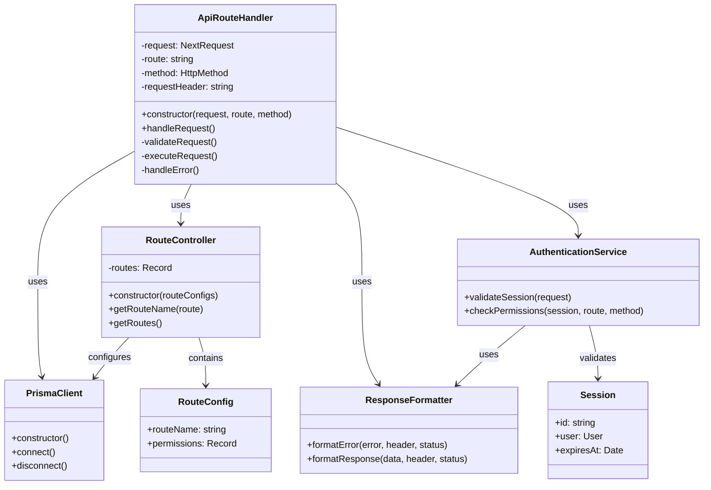

```mermaid
classDiagram
    class ApiRouteHandler {
        -request: NextRequest
        -route: string
        -method: HttpMethod
        -requestHeader: string
        +constructor(request, route, method)
        +handleRequest()
        -validateRequest()
        -executeRequest()
        -handleError()
    }

    class RouteController {
        -routes: Record<PrismaModels, RouteConfig>
        +constructor(routeConfigs)
        +getRouteName(route)
        +getRoutes()
    }

    class ResponseFormatter {
        +formatError(error, header, status)
        +formatResponse(data, header, status)
    }

    class AuthenticationService {
        +validateSession(request)
        +checkPermissions(session, route, method)
    }

    class PrismaClient {
        +constructor()
        +connect()
        +disconnect()
    }

    ApiRouteHandler --> RouteController : uses
    ApiRouteHandler --> ResponseFormatter : uses
    ApiRouteHandler --> AuthenticationService : uses
    ApiRouteHandler --> PrismaClient : uses
    RouteController --> PrismaClient : configures
    AuthenticationService --> ResponseFormatter : uses

    class RouteConfig {
        +routeName: string
        +permissions: Record<HttpMethod, Role[]>
    }

    class Session {
        +id: string
        +user: User
        +expiresAt: Date
    }

    RouteController --> RouteConfig : contains
    AuthenticationService --> Session : validates
```