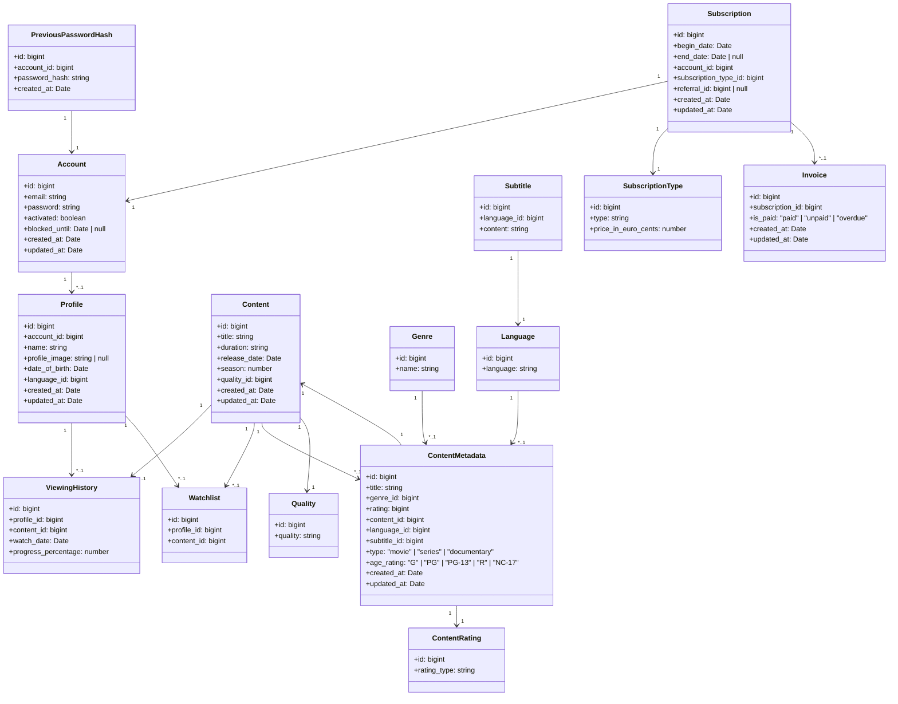

```mermaid
classDiagram
    class Account {
        +id: bigint
        +email: string
        +password: string
        +activated: boolean
        +blocked_until: Date | null
        +created_at: Date
        +updated_at: Date
    }

    class Profile {
        +id: bigint
        +account_id: bigint
        +name: string
        +profile_image: string | null
        +date_of_birth: Date
        +language_id: bigint
        +created_at: Date
        +updated_at: Date
    }

    class Content {
        +id: bigint
        +title: string
        +duration: string
        +release_date: Date
        +season: number
        +quality_id: bigint
        +created_at: Date
        +updated_at: Date
    }

    class ContentMetadata {
        +id: bigint
        +title: string
        +genre_id: bigint
        +rating: bigint
        +content_id: bigint
        +language_id: bigint
        +subtitle_id: bigint
        +type: "movie" | "series" | "documentary"
        +age_rating: "G" | "PG" | "PG-13" | "R" | "NC-17"
        +created_at: Date
        +updated_at: Date
    }

    class Genre {
        +id: bigint
        +name: string
    }

    class ContentRating {
        +id: bigint
        +rating_type: string
    }

    class Quality {
        +id: bigint
        +quality: string
    }

    class Language {
        +id: bigint
        +language: string
    }

    class Subtitle {
        +id: bigint
        +language_id: bigint
        +content: string
    }

    class ViewingHistory {
        +id: bigint
        +profile_id: bigint
        +content_id: bigint
        +watch_date: Date
        +progress_percentage: number
    }

    class Watchlist {
        +id: bigint
        +profile_id: bigint
        +content_id: bigint
    }

    class Subscription {
        +id: bigint
        +begin_date: Date
        +end_date: Date | null
        +account_id: bigint
        +subscription_type_id: bigint
        +referral_id: bigint | null
        +created_at: Date
        +updated_at: Date
    }

    class SubscriptionType {
        +id: bigint
        +type: string
        +price_in_euro_cents: number
    }

    class Invoice {
        +id: bigint
        +subscription_id: bigint
        +is_paid: "paid" | "unpaid" | "overdue"
        +created_at: Date
        +updated_at: Date
    }

    class PreviousPasswordHash {
        +id: bigint
        +account_id: bigint
        +password_hash: string
        +created_at: Date
    }

    %% Associations
    Account "1" --> "*..1" Profile
    Profile "1" --> "*..1" ViewingHistory
    Profile "1" --> "*..1" Watchlist
    Content "1" --> "*..1" ViewingHistory
    Content "1" --> "*..1" Watchlist
    Content "1" --> "*..1" ContentMetadata
    Genre "1" --> "*..1" ContentMetadata
    Language "1" --> "*..1" ContentMetadata
    Subtitle "1" --> "1" Language
    ContentMetadata "1" --> "1" Content
    ContentMetadata "1" --> "1" ContentRating
    Content "1" --> "1" Quality
    Subscription "1" --> "1" Account
    Subscription "1" --> "1" SubscriptionType
    Subscription "1" --> "*..1" Invoice
    PreviousPasswordHash "1" --> "1" Account
```
