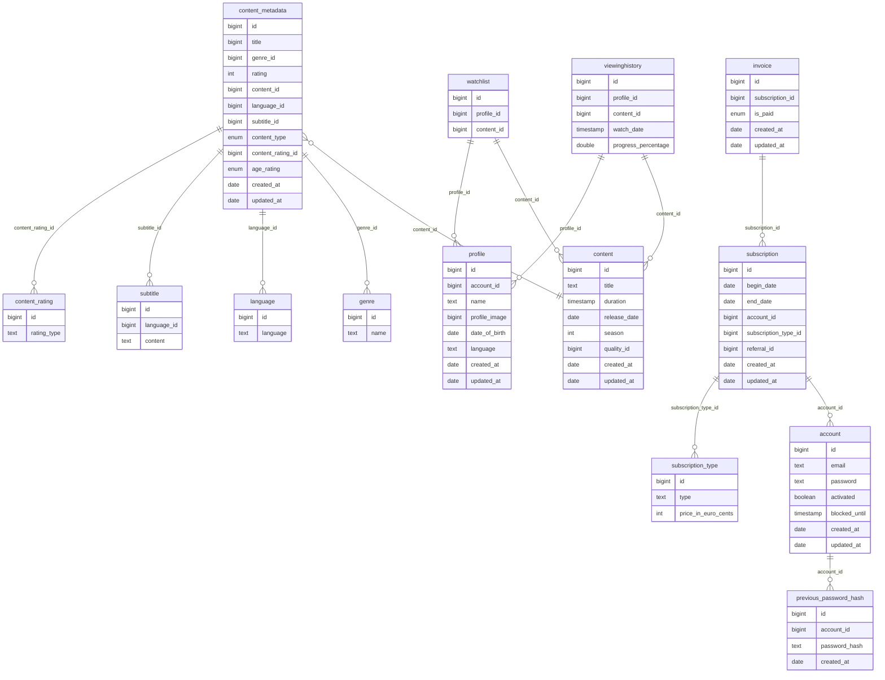

```mermaid
erDiagram
    genre {
        bigint id
        text name
    }
    content_rating {
        bigint id
        text rating_type
    }
    content {
        bigint id
        text title
        timestamp duration
        date release_date
        int season
        bigint quality_id
        date created_at
        date updated_at
    }
    language {
        bigint id
        text language
    }
    subtitle {
        bigint id
        bigint language_id
        text content
    }
    content_metadata {
        bigint id
        bigint title
        bigint genre_id
        int rating
        bigint content_id
        bigint language_id
        bigint subtitle_id
        enum content_type
        bigint content_rating_id
        enum age_rating
        date created_at
        date updated_at
    }
    viewinghistory {
        bigint id
        bigint profile_id
        bigint content_id
        timestamp watch_date
        double progress_percentage
    }
    watchlist {
        bigint id
        bigint profile_id
        bigint content_id
    }
    profile {
        bigint id
        bigint account_id
        text name
        bigint profile_image
        date date_of_birth
        text language
        date created_at
        date updated_at
    }
    subscription {
        bigint id
        date begin_date
        date end_date
        bigint account_id
        bigint subscription_type_id
        bigint referral_id
        date created_at
        date updated_at
    }
    subscription_type {
        bigint id
        text type
        int price_in_euro_cents
    }
    invoice {
        bigint id
        bigint subscription_id
        enum is_paid
        date created_at
        date updated_at
    }
    account {
        bigint id
        text email
        text password
        boolean activated
        timestamp blocked_until
        date created_at
        date updated_at
    }
    previous_password_hash {
        bigint id
        bigint account_id
        text password_hash
        date created_at
    }

    content_metadata }o--|| content : "content_id"
    content_metadata ||--o{ genre : "genre_id"
    content_metadata ||--o{ language : "language_id"
    content_metadata ||--o{ subtitle : "subtitle_id"
    content_metadata ||--o{ content_rating : "content_rating_id"
    viewinghistory ||--o{ content : "content_id"
    viewinghistory ||--o{ profile : "profile_id"
    watchlist ||--o{ content : "content_id"
    watchlist ||--o{ profile : "profile_id"
    subscription ||--o{ account : "account_id"
    subscription ||--o{ subscription_type : "subscription_type_id"
    invoice ||--o{ subscription : "subscription_id"
    account ||--o{ previous_password_hash : "account_id"
```
