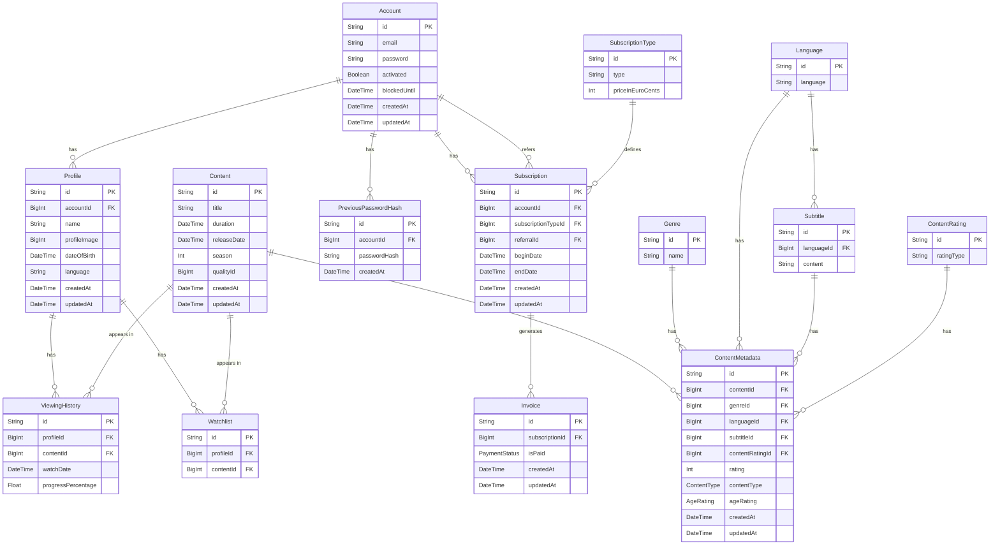

```mermaid
erDiagram
    Account ||--o{ Profile : has
    Account ||--o{ Subscription : has
    Account ||--o{ PreviousPasswordHash : has
    Account ||--o{ Subscription : refers

    Profile ||--o{ ViewingHistory : has
    Profile ||--o{ Watchlist : has

    Content ||--o{ ContentMetadata : has
    Content ||--o{ ViewingHistory : "appears in"
    Content ||--o{ Watchlist : "appears in"

    Genre ||--o{ ContentMetadata : has
    Language ||--o{ ContentMetadata : has
    Language ||--o{ Subtitle : has
    Subtitle ||--o{ ContentMetadata : has
    ContentRating ||--o{ ContentMetadata : has

    SubscriptionType ||--o{ Subscription : "defines"
    Subscription ||--o{ Invoice : generates

    Account {
        String id PK
        String email
        String password
        Boolean activated
        DateTime blockedUntil
        DateTime createdAt
        DateTime updatedAt
    }

    Profile {
        String id PK
        BigInt accountId FK
        String name
        BigInt profileImage
        DateTime dateOfBirth
        String language
        DateTime createdAt
        DateTime updatedAt
    }

    Content {
        String id PK
        String title
        DateTime duration
        DateTime releaseDate
        Int season
        BigInt qualityId
        DateTime createdAt
        DateTime updatedAt
    }

    ContentMetadata {
        String id PK
        BigInt contentId FK
        BigInt genreId FK
        BigInt languageId FK
        BigInt subtitleId FK
        BigInt contentRatingId FK
        Int rating
        ContentType contentType
        AgeRating ageRating
        DateTime createdAt
        DateTime updatedAt
    }

    Genre {
        String id PK
        String name
    }

    Language {
        String id PK
        String language
    }

    Subtitle {
        String id PK
        BigInt languageId FK
        String content
    }

    ContentRating {
        String id PK
        String ratingType
    }

    Subscription {
        String id PK
        BigInt accountId FK
        BigInt subscriptionTypeId FK
        BigInt referralId FK
        DateTime beginDate
        DateTime endDate
        DateTime createdAt
        DateTime updatedAt
    }

    SubscriptionType {
        String id PK
        String type
        Int priceInEuroCents
    }

    Invoice {
        String id PK
        BigInt subscriptionId FK
        PaymentStatus isPaid
        DateTime createdAt
        DateTime updatedAt
    }

    ViewingHistory {
        String id PK
        BigInt profileId FK
        BigInt contentId FK
        DateTime watchDate
        Float progressPercentage
    }

    Watchlist {
        String id PK
        BigInt profileId FK
        BigInt contentId FK
    }

    PreviousPasswordHash {
        String id PK
        BigInt accountId FK
        String passwordHash
        DateTime createdAt
    }
```
